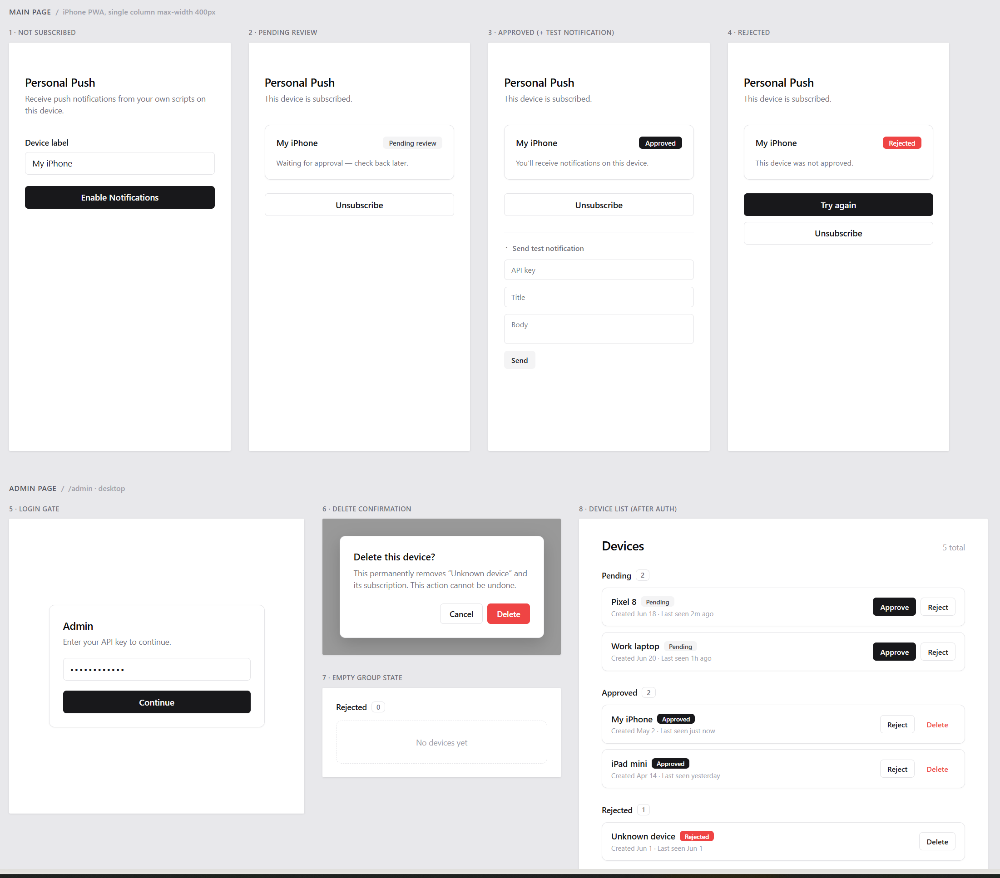

# Personal Push

Send push notifications to your iPhone from any script, cron job, or service — no App Store, no Apple Developer account, no Swift.

Built as a minimal installable PWA using the browser's native Web Push API. Once installed to your Home Screen, iOS delivers pushes via the service worker even when the app isn't open.

## UI



**Main page** (mobile, max-width 400px) has four states depending on subscription status: not subscribed → pending review → approved → rejected. **Admin page** (desktop) shows a login gate followed by a device list grouped by status, with approve / reject / delete actions and a confirmation dialog for destructive operations.

## How it works

```
Your scripts / cron / Home Assistant
        │  POST /api/notify  (Bearer token)
        ▼
   Backend API  ◄──────────────────►  Upstash Redis
        │  Web Push (VAPID-signed)
        ▼
  iOS Push Service  →  Service worker  →  Notification on iPhone
```

Any service that can make an HTTPS POST request can trigger a notification. Devices must be registered via the PWA and manually approved in `/admin` before they receive anything — this prevents strangers who find the URL from subscribing.

## Stack

| Layer | Choice |
|---|---|
| Hosting | Vercel (Hobby / free tier) |
| Subscription store | Upstash Redis (free tier) |
| Push signing | `web-push` (VAPID) |
| Language | TypeScript / Node.js |

## Project structure

```
├── public/
│   ├── index.html          Main PWA page (all 4 states)
│   ├── admin.html          Device review page
│   ├── sw.js               Service worker (push + notificationclick)
│   ├── manifest.json       PWA manifest
│   ├── openapi.json        OpenAPI 3.0 spec (all API endpoints)
│   └── icons/icon.svg      App icon
├── api/
│   ├── config.ts           GET  /api/config
│   ├── notify.ts           POST /api/notify
│   ├── subscribe/
│   │   ├── index.ts        POST /api/subscribe · DELETE /api/subscribe
│   │   └── status.ts       GET  /api/subscribe/status
│   └── admin/devices/
│       ├── index.ts        GET  /api/admin/devices
│       ├── [id].ts         DELETE /api/admin/devices/:id
│       └── [id]/
│           ├── approve.ts  POST /api/admin/devices/:id/approve
│           └── reject.ts   POST /api/admin/devices/:id/reject
├── lib/
│   ├── store.ts            Upstash Redis helpers
│   └── push.ts             web-push wrapper
├── mcp-server.ts           MCP server for AI agents
└── .env.example
```

## Setup

### 1. Clone and install

```bash
git clone <repo>
cd personal-push
npm install
```

### 2. Generate VAPID keys

```bash
npx web-push generate-vapid-keys
```

Keep these — you can't change them after devices subscribe (they'd need to re-subscribe).

### 3. Create an Upstash Redis database

Sign up at [upstash.com](https://upstash.com), create a Redis database (free tier), and copy the REST URL and token.

### 4. Set environment variables

Copy `.env.example` to `.env.local` for local dev, and add the same variables to your Vercel project settings for production.

```
VAPID_PUBLIC_KEY=
VAPID_PRIVATE_KEY=
VAPID_SUBJECT=mailto:you@example.com
API_SECRET_KEY=              # generate with: openssl rand -hex 32
KV_REST_API_URL=
KV_REST_API_TOKEN=
```

### 5. Deploy

```bash
npx vercel --prod
```

In Vercel → Project → Settings → **Deployment Protection**, set Vercel Authentication to **Disabled** so the PWA is publicly accessible.

### 6. Install on iPhone

1. Open the deployment URL in **Safari** on your iPhone
2. Tap **Share → Add to Home Screen**
3. Open the app from the Home Screen icon (required — push doesn't work in a regular tab)
4. Tap **Enable Notifications** and grant permission
5. The page shows "Pending review"

### 7. Approve your device

Open `https://<your-deployment>/admin`, enter your `API_SECRET_KEY`, find the pending device, and click **Approve**.

### 8. Send a test notification

```bash
curl -X POST https://<your-deployment>/api/notify \
  -H "Authorization: Bearer <API_SECRET_KEY>" \
  -H "Content-Type: application/json" \
  -d '{"title": "Hello", "body": "It works!"}'
```

## API reference

Full OpenAPI 3.0 spec is served at `/openapi.json` on your deployment.

### `POST /api/notify` — send a notification

Requires `Authorization: Bearer <API_SECRET_KEY>`.

```json
{
  "title": "Backup complete",
  "body": "Nightly backup finished OK",
  "url": "https://example.com/backups",
  "target": "all"
}
```

`target` is `"all"` (every approved device) or a device label (e.g. `"My iPhone"`). Returns `{ "sent": 1, "failed": 0 }`.

### Admin endpoints

All require `Authorization: Bearer <API_SECRET_KEY>`.

| Method | Path | Description |
|---|---|---|
| `GET` | `/api/admin/devices` | List all devices |
| `POST` | `/api/admin/devices/:id/approve` | Approve a pending device |
| `POST` | `/api/admin/devices/:id/reject` | Reject a device |
| `DELETE` | `/api/admin/devices/:id` | Delete a device record |

## MCP server (AI agents)

Other AI agents can send notifications directly via the included MCP server.

Add to your MCP host config (e.g. `~/.claude/settings.json`):

```json
{
  "mcpServers": {
    "personal-push": {
      "command": "npx",
      "args": ["tsx", "/path/to/personal-push/mcp-server.ts"],
      "env": {
        "PERSONAL_PUSH_URL": "https://your-deployment.vercel.app",
        "PERSONAL_PUSH_API_KEY": "your-secret-key"
      }
    }
  }
}
```

Available tools: `send_notification`, `list_devices`, `approve_device`, `reject_device`, `delete_device`.

## Device approval flow

Every new subscription starts as `pending` and receives no pushes until manually approved. Rejection is sticky — a rejected device stays rejected even if it re-subscribes, preventing a stranger from retrying their way back into the queue. To give a rejected device a second chance, delete it from `/admin`; the next subscribe attempt creates a fresh `pending` entry.

## iOS requirements

- iOS 16.4 or later
- PWA must be installed to the Home Screen (not just open in Safari)
- App must be launched from the Home Screen icon at least once before notifications work
- If you're using an EU Apple ID, check that Web Push for installed PWAs hasn't been restricted in your region
